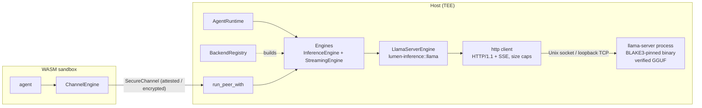

# Inference Engine Integration Design

[](INFERENCE_KR.md)

This document records why Lumen mounts **llama.cpp (`llama-server`)** as its first production inference engine, how the engine is isolated and verified, and how further engines are added without touching the runtime.

---

## Table of Contents

1. [Requirements](#1-requirements)
2. [Engine Survey](#2-engine-survey)
3. [Architecture](#3-architecture)
4. [Trust Boundaries](#4-trust-boundaries)
5. [Determinism and the ZK Path](#5-determinism-and-the-zk-path)
6. [Tool-Call Convention](#6-tool-call-convention)
7. [Policy File Configuration](#7-policy-file-configuration)
8. [Channel Wire Protocol v2](#8-channel-wire-protocol-v2)
9. [Adding Another Engine](#9-adding-another-engine)
10. [Known Gaps and Roadmap](#10-known-gaps-and-roadmap)

---

## 1. Requirements

An inference engine for Lumen has to satisfy the project's non-negotiables before any capability or speed argument is considered.

| Requirement | Consequence for engine selection |
|---|---|
| **Air-gapped build** (`vendor/` + `net.offline`) | No crate that downloads at build time, no `bindgen`/`cmake`/`libclang` in the Rust build, no HuggingFace Hub client. |
| **Verified supply chain** | Engine binary and model weights must both be pinnable with BLAKE3 (and Ed25519 where a signer exists). |
| **`#![forbid(unsafe_code)]` in Lumen crates** | Large C/C++ code cannot be linked into the host process that holds policy state and key material. |
| **Host TEE placement** | The LLM runs on the host side with GPU access; the WASM sandbox only ever sees a `SecureChannel`. The engine must be reachable through a process boundary. |
| **Deterministic routing** | Tool selection must be reproducible for the routing witness: fixed seed, greedy decoding, single slot, no prompt-cache nondeterminism. |
| **Constrained output** | Tool calls must be structurally enforced, not just requested in the prompt. |
| **GGUF first** | `lumen-provenance` already verifies GGUF headers and `QuantizationKind::Gguf` already models the levels. |

## 2. Engine Survey

| Engine | Formats | Hardware | Rust-side build deps | Isolation | Determinism controls | Verdict |
|---|---|---|---|---|---|---|
| **llama.cpp `llama-server`** (out-of-process) | GGUF | CPU, CUDA, Metal, Vulkan, ROCm, SYCL | none (Lumen speaks HTTP/1.1 + SSE over a Unix socket with its own client) | separate process, hash-pinned binary | `seed`, `temperature 0`, `--parallel 1`, `cache_prompt false`, GBNF grammar | **Selected** |
| llama.cpp via `llama-cpp-2` FFI | GGUF | same | `cmake`, `bindgen`, `libclang`, optional CUDA toolkit at *Rust* build time | in-process, `unsafe` FFI | same as above | rejected for v0.6 (audit surface, air-gapped build burden); possible later as `llama-ffi` |
| candle / candle-transformers | safetensors, GGUF | CPU, CUDA, Metal | very large tree (`gemm`, `pulp`, `hf-hub`, `tokenizers`) | in-process | seed only | removed in v0.4/v0.5 for dependency size and Hub client |
| mistral.rs | safetensors, GGUF, GPTQ | CPU, CUDA, Metal | built on candle, larger | in-process or its own server | seed | inherits candle concerns; its server would fit the OpenAI-compatible adapter |
| burn | own, ONNX import | CPU, wgpu, CUDA | large | in-process | partial | not LLM-focused enough |
| ONNX Runtime (`ort`) | ONNX | CPU, CUDA, TensorRT | downloads prebuilt binaries by default, C++ | in-process | limited | rejected for air-gap; ONNX header checks stay in provenance |
| tract | ONNX, NNEF | CPU | pure Rust, moderate | in-process | good (integer paths) | candidate for small routing classifiers on the ZK path, not for generation |
| vLLM / SGLang / TGI / TensorRT-LLM | HF, GGUF (partial) | GPU clusters | Python/C++ services | separate service | seed, limited grammar | reachable later via an OpenAI-compatible adapter over `SecureChannel` |

`llama-server` wins on every hard requirement. It also has the widest offline model ecosystem (single GGUF file), a stable native API exposing seed, grammar and token ids, and operators who need GPU builds already compile it themselves, so shipping a hash-pinned binary into an air-gapped site is the natural workflow.

## 3. Architecture



The crate is layered so that each layer can be swapped independently.

| Layer | Types | Responsibility |
|---|---|---|
| Contract | `InferenceEngine`, `StreamingEngine`, `EngineInfo`, `EngineCapabilities` | What the agent runtime depends on. `info()` lets the runtime query streaming, grammar, determinism and context length. |
| Bundle | `Engines` | One backend's `Arc<dyn InferenceEngine>` plus optional `Arc<dyn StreamingEngine>`. `AgentRuntimeBuilder::engines` wires both. |
| Factory | `BackendConfig` (typed, feature-gated) and `BackendRegistry` (name -> async factory) | The registry is the extension point: external crates register a name and a factory that consumes `BTreeMap<String, String>` params. Factories must reject unknown keys. |
| Tool calls | `toolcall::parse_tool_call`, `ToolCallGrammar` | Backend-independent convention for turning text into `ToolCall`, plus a GBNF generator that constrains the model to registered tool ids. |
| Transport | `http` | Minimal HTTP/1.1 client over any `AsyncRead + AsyncWrite`: `Content-Length`, chunked, until-close bodies, SSE `data:` framing, header injection rejection, hard size caps. |
| Protocol | `llama::protocol` | Serde types for `llama-server`'s native `/completion`, `/health`, `/props`. Native API is used because the OpenAI-compatible surface does not expose grammar, seed and token ids together. |
| Process | `llama::process` | Spawns and supervises `llama-server`: binary hash check, reserved-argument rejection, `LLAMA_ARG_*` environment scrubbing, API key via environment, kill on drop, socket cleanup. |
| Channel peer | `tee_channel` | `ChannelEngine` (sandbox side) and `run_peer_with` (host side) carry the same `Engines` over any `SecureChannel`, with streaming frames. |

Two launch modes exist. **Spawn** is the production path: Lumen verifies the binary, generates a fresh 256-bit API key, starts the server on a Unix socket, waits for `/health`, and binds `/props.model_path` to the verified model handle. **Attach** connects to a server started elsewhere (for example under a systemd unit inside the TEE) and still enforces the `/props` binding when a verified handle is supplied.

## 4. Trust Boundaries

| Asset or channel | Control | Where |
|---|---|---|
| Engine binary and shared libraries | `EngineManifest`: Ed25519 signature over name, version and the whole hash set, checked against `trusted_signers` before any file is opened; every pinned file must be a regular, non-world-writable file whose BLAKE3 matches; the pins are re-checked immediately before `spawn` | `lumen_provenance::verify_engine`, `llama::process` |
| Model weights | `VerifiedModelLoader` (BLAKE3 + optional Ed25519); engines only accept `VerifiedModelHandle` | `loader` |
| Served model = verified model | `/props.model_path` canonicalised and compared with the handle; missing field -> refuse | `LlamaServerEngine::from_config` |
| Request authentication | Per-process random API key, passed through `LLAMA_API_KEY` (never argv), sent as `Authorization: Bearer` | `process`, `llama` |
| Argument injection | All `LLAMA_ARG_*` variables removed from the child environment; `--api-key`, `-m`, `--host`, `--port`, `-hf`, `--model-url` refused in `extra_args` | `process` |
| Transport | Unix domain socket by default; TCP only to loopback, refused otherwise at parse and connect time | `Endpoint` |
| Response handling | 16 KiB header cap, 64 MiB body cap, 4 MiB SSE event cap, chunked-framing validation, per-request and idle timeouts | `http`, `llama` |
| Web surface | `--no-webui`, no metrics or slots endpoints enabled | `process` |
| Tool selection | GBNF grammar enumerating registered tool ids; parser re-validates ids and JSON shape; args re-serialised in key order before hashing | `toolcall` |
| Secrets in memory | API keys and signing-key seeds held in `Zeroizing` buffers | `llama`, `lumen keygen` |

### Engine manifest

An engine is described the same way as a model: a signed manifest that pins the executable and every shared library it loads.

```toml
[[engines]]
name      = "llama-server"
version   = "b10603"
path      = "/opt/llama.cpp/llama-server"
hash      = "<blake3 of the executable>"
files     = [{ path = "/opt/llama.cpp/lib/libllama.so", hash = "<blake3>" }]
signature = "<ed25519 over the body>"
signer    = "<signer public key>"
```

The signature covers `name`, `version`, `hash`, the `(file name, hash)` list and `license`, but not the paths, so the manifest stays valid after relocation. Verification is fail-fast and cheap: the signature (microseconds) is checked before any file is opened, then each file is checked for type and permissions, then hashed once. If `trusted_signers` is non-empty, an unsigned manifest or a signer outside the set is rejected; only with no trusted signers does a hash-only manifest pass, with a warning. `lumen keygen`, `lumen sign-engine` and `lumen verify-engine` produce and check these manifests; `lumen sign-model` signs model manifests with the same key. Both kinds use distinct domain-separation prefixes, so a model signature cannot be replayed as an engine signature.

What the design does **not** claim: the host process cannot attest the memory of `llama-server`; that is the TEE's job. Plaintext HTTP is acceptable only because the socket never leaves the host; a remote engine must sit behind a `SecureChannel` peer. Operators should additionally confine `llama-server` with the OS sandbox of their platform (seccomp/Landlock, sandbox-exec, or a dedicated VM).

## 5. Determinism and the ZK Path

Lumen proves *routing decisions*, not generation. For the routing witness to be reproducible, the completion that yields the tool call must be reproducible too.

- `SamplingParams { temperature: 0.0, seed: Some(n), .. }` and `cache_prompt = false` are the defaults for the llama-server backend.
- `SpawnSpec::parallel` defaults to `1`. `EngineCapabilities::seed_deterministic` is reported `true` only when `/props.total_slots == 1`, because multi-slot batching changes floating-point accumulation order.
- The prompt hash, policy hash and chosen tool id are still what enters `RoutingPublicInputs`; the engine output text is not part of the public inputs.
- Cross-machine bit equality is **not** promised. Different GPU kernels or CPU SIMD paths can change logits. Reproducibility holds per (binary hash, model hash, hardware class, parameters).

## 6. Tool-Call Convention

A model asks for a tool by emitting one JSON object:

```json
{"tool": "echo", "args": {"text": "hi"}}
```

`parse_tool_call` looks at the whole text, then inside a ```` ```json ```` fence, then at the first `{` .. last `}` span. Ids must satisfy `ToolId` rules and `args` must be an object; anything else is treated as free text, never as an error. Arguments are normalised through `serde_json::Value` (BTreeMap order) so `args_hash` in the witness is stable.

`ToolCallGrammar::new(tool_ids).gbnf()` yields a grammar whose `tool` rule enumerates the registered ids and whose `args` rule is generic JSON. `lumen run` generates it from the tool registry and passes it as the `grammar` param, so an unregistered tool name cannot be generated at the token level. Streaming steps parse the accumulated text at finalisation using the same function, so streaming and non-streaming paths route identically.

## 7. Policy File Configuration

```toml
trusted_signers = ["<signer public key hex>"]   # models and engines must then be signed

[[engines]]
name = "llama-server"
version = "b10603"
path = "/opt/llama.cpp/llama-server"
hash = "<blake3 hex of the binary>"
files = [{ path = "/opt/llama.cpp/lib/libllama.so", hash = "<blake3>" }]
signature = "<hex>"
signer = "<signer public key hex>"

[inference]
backend = "llama-server"

[inference.params]
mode        = "spawn"                       # or "attach"
endpoint    = "unix:/run/lumen/llama.sock"  # or "tcp:127.0.0.1:8080"
binary      = "llama-server"                # an [[engines]] name, or a path with binary_hash
model       = "qwen2.5-1.5b"                # a [[models]] name, or a GGUF path with model_hash
n_ctx       = "4096"
gpu_layers  = "99"
parallel    = "1"
```

| Key | Mode | Meaning |
|---|---|---|
| `mode` | both | `spawn` or `attach` |
| `endpoint` | both | `unix:<path.sock>` or `tcp:<loopback ip>:<port>` |
| `model`, `model_hash`, `model_name`, `model_version` | both | GGUF path + BLAKE3; when `model` names a `[[models]]` entry the CLI substitutes path, hash, name and version from the manifest |
| `binary`, `binary_hash`, `binary_files` | spawn | engine binary, its BLAKE3 pin and a JSON array of `{path, hash}` pins for shared libraries; when `binary` names an `[[engines]]` entry the CLI verifies that manifest (signature against `trusted_signers`, then every file) and substitutes all three |
| `n_ctx`, `threads`, `gpu_layers`, `parallel`, `extra_args`, `startup_timeout_secs` | spawn | passed to `llama-server` (`-c`, `-t`, `-ngl`, `--parallel`), reserved arguments refused |
| `api_key_file` | attach | file containing the server's API key (keep it 0600) |
| `request_timeout_secs`, `cache_prompt`, `grammar` | both | client behaviour; `grammar` is normally injected by the CLI |

Because the whole policy file is BLAKE3-pinned by `lumen run --policy-hash`, the engine binary hash and model hash are pinned by the same mechanism as capabilities.

## 8. Channel Wire Protocol v2

```text
client -> peer : InferRequest { version: 2, prompt, params, stream }
peer -> client : InferFrame::Token(Token)*  then  InferFrame::Done(Completion)
                 InferFrame::Error(String)  at any point
```

`run_peer_with(channel, &engines)` serves any `Engines` bundle. If the client asks for streaming and the backend supports it, tokens are forwarded as they arrive and the accumulated text is parsed for a tool call before `Done`. `ChannelEngine` implements both traits on the sandbox side; a stream dropped mid-way drains the remaining frames in the background so the channel stays synchronised. Version mismatches are answered with `Error`, never silently decoded.

## 9. Adding Another Engine

1. Implement `InferenceEngine` (and `StreamingEngine` if tokens can be streamed). Override `info()` so the runtime can see capabilities.
2. Feed raw completion text through `parse_tool_call` unless the engine produces structured calls natively (`native_tool_calls = true`).
3. Register a factory: `registry.register("my-engine", |params| async move { ... Ok(Engines::from_dual(Arc::new(engine))) })`. Use `reject_unknown_params` so typos fail closed.
4. Gate heavy dependencies behind a Cargo feature and vendor them with `./scripts/vendor.sh`.
5. Bind every artefact the engine loads (binary, weights, tokenizer) to a BLAKE3 pin and expose it through the policy file.

Planned adapters that fit the same skeleton:

- **OpenAI-compatible HTTP** (`/v1/completions`) for vLLM, SGLang, TGI, Ollama and mistral.rs servers. The `http` module already provides the transport; only a protocol module and a factory are needed. It will run behind a `SecureChannel` peer when the server is on another host.
- **tract** for small ONNX routing classifiers whose integer arithmetic can be bound to the ZK witness directly.
- **`llama-ffi`** (`llama-cpp-2`) for embedded single-binary deployments where a process boundary is impossible; it stays opt-in because it needs `cmake`/`bindgen` and `unsafe`.

## 10. Known Gaps and Roadmap

- Engine manifests pin files by content; OS-level code signing (Apple codesign, Authenticode, IMA) is not consulted, so a signed manifest is the only chain from the policy pin to the bytes that run.
- Chat template rendering is left to the agent. `llama-server` exposes `/apply-template`; a helper may be added once the prompt format policy is settled.
- `Token.id` is `None` when a streaming chunk carries more than one token id.
- The host does not yet feed `llama-server`'s stderr into the audit log; it is traced at `debug` level.
- OS-level confinement of the child process is documented, not enforced by Lumen.
