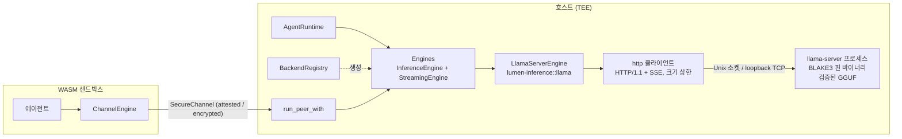

# 추론 엔진 통합 설계

[](INFERENCE.md)

이 문서는 Lumen 이 첫 production 추론 엔진으로 **llama.cpp (`llama-server`)** 를 선택한 이유, 엔진을 격리하고 검증하는 방식, 그리고 런타임을 건드리지 않고 다른 엔진을 추가하는 방법을 기록합니다.

---

## 목차

1. [요구사항](#1-요구사항)
2. [엔진 조사](#2-엔진-조사)
3. [아키텍처](#3-아키텍처)
4. [신뢰 경계](#4-신뢰-경계)
5. [결정론과 ZK 경로](#5-결정론과-zk-경로)
6. [도구 호출 규약](#6-도구-호출-규약)
7. [정책 파일 설정](#7-정책-파일-설정)
8. [채널 와이어 프로토콜 v2](#8-채널-와이어-프로토콜-v2)
9. [다른 엔진 추가하기](#9-다른-엔진-추가하기)
10. [알려진 공백과 로드맵](#10-알려진-공백과-로드맵)

---

## 1. 요구사항

Lumen 의 추론 엔진은 기능이나 속도를 논하기 전에 프로젝트의 양보 불가 원칙을 먼저 만족해야 합니다.

| 요구사항 | 엔진 선택에 미치는 영향 |
|---|---|
| **폐쇄망 빌드** (`vendor/` + `net.offline`) | 빌드 시 다운로드하는 크레이트 금지, Rust 빌드에 `bindgen`/`cmake`/`libclang` 금지, HuggingFace Hub 클라이언트 금지 |
| **검증된 공급망** | 엔진 바이너리와 모델 가중치 모두 BLAKE3 (서명자가 있으면 Ed25519) 로 핀 가능해야 함 |
| **Lumen 크레이트의 `#![forbid(unsafe_code)]`** | 정책 상태와 키 자료를 쥔 호스트 프로세스에 대형 C/C++ 코드를 링크할 수 없음 |
| **호스트 TEE 배치** | LLM 은 GPU 가 있는 호스트 측에서 실행되고 WASM 샌드박스는 `SecureChannel` 만 봅니다. 엔진은 프로세스 경계 너머에서 접근 가능해야 함 |
| **결정론적 라우팅** | 도구 선택은 라우팅 witness 를 위해 재현 가능해야 함. 고정 시드, greedy 디코딩, 단일 슬롯, 프롬프트 캐시 비결정성 배제 |
| **출력 제약** | 도구 호출은 프롬프트로 부탁하는 것이 아니라 구조적으로 강제되어야 함 |
| **GGUF 우선** | `lumen-provenance` 가 이미 GGUF 헤더를 검증하고 `QuantizationKind::Gguf` 가 레벨을 모델링함 |

## 2. 엔진 조사

| 엔진 | 형식 | 하드웨어 | Rust 측 빌드 의존 | 격리 | 결정론 제어 | 판정 |
|---|---|---|---|---|---|---|
| **llama.cpp `llama-server`** (프로세스 분리) | GGUF | CPU, CUDA, Metal, Vulkan, ROCm, SYCL | 없음 (Lumen 자체 HTTP/1.1 + SSE 클라이언트가 Unix 소켓으로 통신) | 별도 프로세스, 해시 핀 바이너리 | `seed`, `temperature 0`, `--parallel 1`, `cache_prompt false`, GBNF 문법 | **채택** |
| llama.cpp `llama-cpp-2` FFI | GGUF | 동일 | *Rust* 빌드 시 `cmake`, `bindgen`, `libclang`, 선택적 CUDA 툴킷 | in-process, `unsafe` FFI | 동일 | v0.6 에서는 제외 (감사 표면, 폐쇄망 빌드 부담). 추후 `llama-ffi` 로 가능 |
| candle / candle-transformers | safetensors, GGUF | CPU, CUDA, Metal | 매우 큰 트리 (`gemm`, `pulp`, `hf-hub`, `tokenizers`) | in-process | 시드만 | 의존성 크기와 Hub 클라이언트 때문에 v0.4/v0.5 에서 제거 |
| mistral.rs | safetensors, GGUF, GPTQ | CPU, CUDA, Metal | candle 기반, 더 큼 | in-process 또는 자체 서버 | 시드 | candle 의 문제를 상속. 서버 형태는 OpenAI 호환 어댑터로 수용 가능 |
| burn | 자체, ONNX import | CPU, wgpu, CUDA | 큼 | in-process | 부분적 | LLM 특화가 부족 |
| ONNX Runtime (`ort`) | ONNX | CPU, CUDA, TensorRT | 기본적으로 빌드 시 바이너리 다운로드, C++ | in-process | 제한적 | 폐쇄망 부적합. ONNX 헤더 검사는 provenance 에 유지 |
| tract | ONNX, NNEF | CPU | 순수 Rust, 중간 규모 | in-process | 우수 (정수 경로) | ZK 경로의 소형 라우팅 분류기 후보. 생성용은 아님 |
| vLLM / SGLang / TGI / TensorRT-LLM | HF, GGUF (일부) | GPU 클러스터 | Python/C++ 서비스 | 별도 서비스 | 시드, 제한된 문법 | `SecureChannel` 위 OpenAI 호환 어댑터로 추후 연결 |

`llama-server` 는 모든 필수 요구사항을 만족합니다. 오프라인 모델 생태계가 가장 넓고 (GGUF 단일 파일), 시드·문법·토큰 ID 를 모두 노출하는 안정된 네이티브 API 가 있으며, GPU 빌드가 필요한 운영자는 어차피 직접 컴파일하므로 해시 핀 바이너리를 폐쇄망에 반입하는 것이 자연스러운 워크플로우입니다.

## 3. 아키텍처



크레이트는 각 계층을 독립적으로 교체할 수 있도록 나뉘어 있습니다.

| 계층 | 타입 | 책임 |
|---|---|---|
| 계약 | `InferenceEngine`, `StreamingEngine`, `EngineInfo`, `EngineCapabilities` | 에이전트 런타임이 의존하는 것. `info()` 로 스트리밍·문법·결정론·컨텍스트 길이를 질의 |
| 묶음 | `Engines` | 한 백엔드의 `Arc<dyn InferenceEngine>` 과 선택적 `Arc<dyn StreamingEngine>`. `AgentRuntimeBuilder::engines` 가 둘을 함께 wiring |
| 팩토리 | `BackendConfig` (타입 안전, feature 게이트) 와 `BackendRegistry` (이름 -> async 팩토리) | 레지스트리가 확장점. 외부 크레이트는 이름과 `BTreeMap<String, String>` 파라미터를 받는 팩토리를 등록. 팩토리는 모르는 키를 거부해야 함 |
| 도구 호출 | `toolcall::parse_tool_call`, `ToolCallGrammar` | 텍스트를 `ToolCall` 로 바꾸는 백엔드 독립 규약과, 등록된 도구 ID 로 모델을 제약하는 GBNF 생성기 |
| 전송 | `http` | 임의의 `AsyncRead + AsyncWrite` 위 최소 HTTP/1.1 클라이언트. `Content-Length`, chunked, 연결 종료 바디, SSE `data:` 프레이밍, 헤더 인젝션 거부, 크기 상한 |
| 프로토콜 | `llama::protocol` | `llama-server` 네이티브 `/completion`, `/health`, `/props` 의 serde 타입. OpenAI 호환 표면은 문법·시드·토큰 ID 를 함께 노출하지 않아 네이티브 API 사용 |
| 프로세스 | `llama::process` | `llama-server` 기동·감독. 바이너리 해시 검사, 예약 인자 거부, `LLAMA_ARG_*` 환경변수 제거, 환경변수 API 키 전달, drop 시 kill, 소켓 정리 |
| 채널 peer | `tee_channel` | `ChannelEngine` (샌드박스 측) 과 `run_peer_with` (호스트 측) 가 같은 `Engines` 를 임의의 `SecureChannel` 위로 스트리밍 프레임과 함께 운반 |

기동 모드는 두 가지입니다. **Spawn** 은 production 경로로, Lumen 이 바이너리를 검증하고 새 256-bit API 키를 생성한 뒤 Unix 소켓에 서버를 띄우고 `/health` 를 기다린 다음 `/props.model_path` 를 검증된 모델 핸들에 바인드합니다. **Attach** 는 다른 곳 (예: TEE 안의 systemd 유닛) 에서 시작된 서버에 접속하며, 검증 핸들이 주어지면 동일하게 `/props` 바인딩을 강제합니다.

## 4. 신뢰 경계

| 자산 또는 채널 | 통제 | 위치 |
|---|---|---|
| 엔진 바이너리와 공유 라이브러리 | `EngineManifest`: 이름·버전·해시 집합 전체에 대한 Ed25519 서명을 파일을 열기 전에 `trusted_signers` 로 검증. 핀된 파일은 모두 일반 파일이고 world-writable 이 아니며 BLAKE3 가 일치해야 함. 핀은 `spawn` 직전에 다시 검사 | `lumen_provenance::verify_engine`, `llama::process` |
| 모델 가중치 | `VerifiedModelLoader` (BLAKE3 + 선택적 Ed25519). 엔진은 `VerifiedModelHandle` 만 받음 | `loader` |
| 서빙 모델 = 검증 모델 | `/props.model_path` 를 정규화해 핸들과 비교. 필드 없으면 거부 | `LlamaServerEngine::from_config` |
| 요청 인증 | 프로세스별 난수 API 키를 `LLAMA_API_KEY` 로 전달 (argv 금지), `Authorization: Bearer` 로 송신 | `process`, `llama` |
| 인자 주입 | 자식 환경에서 `LLAMA_ARG_*` 전부 제거. `extra_args` 의 `--api-key`, `-m`, `--host`, `--port`, `-hf`, `--model-url` 거부 | `process` |
| 전송 | 기본 Unix 도메인 소켓. TCP 는 loopback 만 허용, 파싱과 접속 시 모두 거부 | `Endpoint` |
| 응답 처리 | 헤더 16 KiB, 바디 64 MiB, SSE 이벤트 4 MiB 상한, chunked 프레이밍 검증, 요청·유휴 타임아웃 | `http`, `llama` |
| 웹 표면 | `--no-webui`, metrics / slots 엔드포인트 미활성 | `process` |
| 도구 선택 | 등록 도구 ID 를 열거하는 GBNF 문법. 파서가 ID 와 JSON 형태를 재검증하고 args 를 키 순서로 재직렬화한 뒤 해시 | `toolcall` |
| 메모리 내 비밀 | API 키와 서명 키 시드는 `Zeroizing` 버퍼 으로 보관 | `llama`, `lumen keygen` |

### 엔진 매니페스트

엔진도 모델과 같은 방식으로 기술합니다. 실행 파일과 그것이 로드하는 공유 라이브러리 전부를 핀한 서명된 매니페스트입니다.

```toml
[[engines]]
name      = "llama-server"
version   = "b10603"
path      = "/opt/llama.cpp/llama-server"
hash      = "<실행 파일의 blake3>"
files     = [{ path = "/opt/llama.cpp/lib/libllama.so", hash = "<blake3>" }]
signature = "<본문에 대한 ed25519>"
signer    = "<서명자 공개 키>"
```

서명은 `name`, `version`, `hash`, `(파일 이름, 해시)` 목록, `license` 를 덮고 경로는 덮지 않으므로 배포 위치를 옮겨도 유효합니다. 검증은 fail-fast 이며 저렴합니다. 파일을 열기 전에 서명 (마이크로초) 을 먼저 검사하고, 파일마다 종류와 권한을 확인한 뒤 한 번만 해시합니다. `trusted_signers` 가 비어있지 않으면 미서명 매니페스트와 집합 밖 서명자는 거부되고, 신뢰 서명자가 없을 때만 해시 전용 매니페스트가 경고와 함께 통과합니다. `lumen keygen`, `lumen sign-engine`, `lumen verify-engine` 이 이 매니페스트를 만들고 검사하며, `lumen sign-model` 은 같은 키로 모델 매니페스트에 서명합니다. 두 종류는 서로 다른 도메인 분리 prefix 를 쓰므로 모델 서명을 엔진 서명으로 재사용할 수 없습니다.

이 설계가 **주장하지 않는 것**: 호스트 프로세스는 `llama-server` 의 메모리를 attest 할 수 없습니다. 그것은 TEE 의 역할입니다. 평문 HTTP 는 소켓이 호스트를 벗어나지 않기 때문에만 허용되며, 원격 엔진은 반드시 `SecureChannel` peer 뒤에 두어야 합니다. 운영자는 추가로 플랫폼의 OS 샌드박스 (seccomp/Landlock, sandbox-exec, 전용 VM) 로 `llama-server` 를 가두는 것을 권장합니다.

## 5. 결정론과 ZK 경로

Lumen 이 증명하는 것은 *라우팅 결정* 이지 생성이 아닙니다. 라우팅 witness 가 재현되려면 도구 호출을 만들어낸 completion 도 재현되어야 합니다.

- llama-server 백엔드의 기본값은 `SamplingParams { temperature: 0.0, seed: Some(n), .. }` 와 `cache_prompt = false` 입니다.
- `SpawnSpec::parallel` 기본값은 `1` 입니다. 다중 슬롯 배칭은 부동소수 누적 순서를 바꾸므로 `EngineCapabilities::seed_deterministic` 은 `/props.total_slots == 1` 일 때만 `true` 로 보고됩니다.
- `RoutingPublicInputs` 에 들어가는 것은 여전히 프롬프트 해시, 정책 해시, 선택된 도구 ID 입니다. 엔진 출력 텍스트는 공개 입력이 아닙니다.
- 머신 간 비트 동일성은 **약속하지 않습니다**. GPU 커널이나 CPU SIMD 경로가 다르면 로짓이 달라질 수 있습니다. 재현성은 (바이너리 해시, 모델 해시, 하드웨어 종류, 파라미터) 단위로 성립합니다.

## 6. 도구 호출 규약

모델은 JSON 객체 하나로 도구를 요청합니다.

```json
{"tool": "echo", "args": {"text": "hi"}}
```

`parse_tool_call` 은 전체 텍스트, 그다음 ```` ```json ```` 펜스 내부, 그다음 첫 `{` 부터 마지막 `}` 구간을 봅니다. ID 는 `ToolId` 규칙을 만족해야 하고 `args` 는 객체여야 합니다. 그 외는 에러가 아닌 자유 텍스트로 처리합니다. 인자는 `serde_json::Value` (BTreeMap 순서) 로 정규화되어 witness 의 `args_hash` 가 안정적입니다.

`ToolCallGrammar::new(tool_ids).gbnf()` 는 `tool` 규칙이 등록 ID 를 열거하고 `args` 규칙은 일반 JSON 인 문법을 만듭니다. `lumen run` 은 도구 등록부에서 이를 생성해 `grammar` 파라미터로 넘기므로, 등록되지 않은 도구 이름은 토큰 수준에서 생성될 수 없습니다. 스트리밍 step 도 마무리 시 누적 텍스트를 같은 함수로 파싱하므로 스트리밍·비스트리밍 경로의 라우팅이 동일합니다.

## 7. 정책 파일 설정

```toml
trusted_signers = ["<서명자 공개 키 hex>"]   # 설정하면 모델과 엔진 모두 서명 필수

[[engines]]
name = "llama-server"
version = "b10603"
path = "/opt/llama.cpp/llama-server"
hash = "<바이너리의 BLAKE3 hex>"
files = [{ path = "/opt/llama.cpp/lib/libllama.so", hash = "<blake3>" }]
signature = "<hex>"
signer = "<서명자 공개 키 hex>"

[inference]
backend = "llama-server"

[inference.params]
mode        = "spawn"                       # 또는 "attach"
endpoint    = "unix:/run/lumen/llama.sock"  # 또는 "tcp:127.0.0.1:8080"
binary      = "llama-server"                # [[engines]] 의 name, 또는 경로 + binary_hash
model       = "qwen2.5-1.5b"                # [[models]] 의 name, 또는 GGUF 경로 + model_hash
n_ctx       = "4096"
gpu_layers  = "99"
parallel    = "1"
```

| 키 | 모드 | 의미 |
|---|---|---|
| `mode` | 공통 | `spawn` 또는 `attach` |
| `endpoint` | 공통 | `unix:<path.sock>` 또는 `tcp:<loopback ip>:<port>` |
| `model`, `model_hash`, `model_name`, `model_version` | 공통 | GGUF 경로 + BLAKE3. `model` 이 `[[models]]` 항목 이름이면 CLI 가 매니페스트의 경로·해시·이름·버전으로 치환 |
| `binary`, `binary_hash`, `binary_files` | spawn | 엔진 바이너리, BLAKE3 핀, 공유 라이브러리 핀의 JSON 배열 (`{path, hash}`). `binary` 가 `[[engines]]` 항목 이름이면 CLI 가 그 매니페스트를 검증 (서명 -> 파일 전부) 한 뒤 셋 모두 치환 |
| `n_ctx`, `threads`, `gpu_layers`, `parallel`, `extra_args`, `startup_timeout_secs` | spawn | `llama-server` 에 전달 (`-c`, `-t`, `-ngl`, `--parallel`). 예약 인자는 거부 |
| `api_key_file` | attach | 서버 API 키가 든 파일 (0600 권장) |
| `request_timeout_secs`, `cache_prompt`, `grammar` | 공통 | 클라이언트 동작. `grammar` 는 보통 CLI 가 주입 |

정책 파일 전체가 `lumen run --policy-hash` 로 BLAKE3 핀되므로, 엔진 바이너리 해시와 모델 해시도 capability 와 같은 메커니즘으로 핀됩니다.

## 8. 채널 와이어 프로토콜 v2

```text
client -> peer : InferRequest { version: 2, prompt, params, stream }
peer -> client : InferFrame::Token(Token)*  이후  InferFrame::Done(Completion)
                 InferFrame::Error(String)  언제든
```

`run_peer_with(channel, &engines)` 는 어떤 `Engines` 묶음이든 서빙합니다. 클라이언트가 스트리밍을 요청했고 백엔드가 지원하면 토큰을 도착 즉시 forward 하고, `Done` 전에 누적 텍스트에서 도구 호출을 파싱합니다. 샌드박스 측 `ChannelEngine` 은 두 trait 을 모두 구현하며, 도중에 drop 된 스트림은 남은 프레임을 백그라운드에서 소진해 채널 동기화를 유지합니다. 버전 불일치는 조용히 디코딩하지 않고 `Error` 로 응답합니다.

## 9. 다른 엔진 추가하기

1. `InferenceEngine` (토큰 스트리밍이 가능하면 `StreamingEngine` 도) 을 구현합니다. 런타임이 기능을 볼 수 있도록 `info()` 를 재정의합니다.
2. 엔진이 구조화된 호출을 직접 만들지 않는 한 (`native_tool_calls = true`) 원시 completion 텍스트를 `parse_tool_call` 에 통과시킵니다.
3. 팩토리를 등록합니다: `registry.register("my-engine", |params| async move { ... Ok(Engines::from_dual(Arc::new(engine))) })`. 오타가 fail-closed 되도록 `reject_unknown_params` 를 사용합니다.
4. 무거운 의존성은 Cargo feature 뒤에 두고 `./scripts/vendor.sh` 로 벤더링합니다.
5. 엔진이 로드하는 모든 산출물 (바이너리, 가중치, 토크나이저) 을 BLAKE3 핀에 바인드하고 정책 파일로 노출합니다.

같은 골격에 맞는 계획된 어댑터:

- **OpenAI 호환 HTTP** (`/v1/completions`): vLLM, SGLang, TGI, Ollama, mistral.rs 서버용. `http` 모듈이 전송을 이미 제공하므로 프로토콜 모듈과 팩토리만 필요합니다. 서버가 다른 호스트에 있으면 `SecureChannel` peer 뒤에서 동작합니다.
- **tract**: 정수 산술을 ZK witness 에 직접 바인드할 수 있는 소형 ONNX 라우팅 분류기용.
- **`llama-ffi`** (`llama-cpp-2`): 프로세스 경계가 불가능한 임베디드 단일 바이너리 배포용. `cmake`/`bindgen` 과 `unsafe` 가 필요하므로 opt-in 으로 유지합니다.

## 10. 알려진 공백과 로드맵

- 엔진 매니페스트는 파일 내용을 핀할 뿐 OS 코드 서명 (Apple codesign, Authenticode, IMA) 은 참조하지 않으므로, 정책 핀에서 실행되는 바이트까지의 유일한 체인은 서명된 매니페스트입니다.
- 채팅 템플릿 렌더링은 에이전트 몫입니다. `llama-server` 의 `/apply-template` 을 감싸는 헬퍼는 프롬프트 형식 정책이 정해지면 추가할 수 있습니다.
- 스트리밍 청크가 토큰 ID 를 둘 이상 담으면 `Token.id` 는 `None` 입니다.
- 호스트는 아직 `llama-server` 의 stderr 를 감사 로그에 넣지 않고 `debug` 레벨로 trace 합니다.
- 자식 프로세스의 OS 수준 격리는 문서로 권장할 뿐 Lumen 이 강제하지 않습니다.
