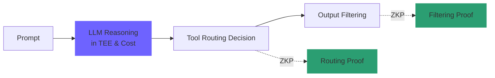
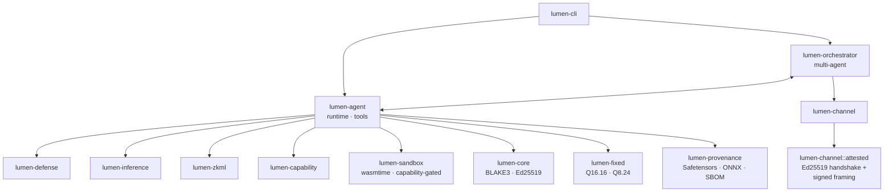

# Lumen

[](INTRODUCTION.md)
[](https://discord.gg/9utg4hp3m8)

Lumen is an open-source, verifiable AI agent framework for zero-trust environments.

## Why Lumen

As LLM agents enter highly regulated domains such as healthcare, finance, defense, and government, two fundamental problems arise simultaneously.

1. *"How can we trust the agent's behavior?"*
   - Whether model weights have been tampered with, whether policies have been bypassed, whether tool-call decisions are externally verifiable
2. *"How can we control the agent's permissions?"*
   - Whether file, network, and system calls occur only within explicitly authorized scope, whether permission tokens cannot be forged or replayed

Existing LLM agent frameworks such as *LangChain*, *AutoGPT*, and *CrewAI* prioritize developer convenience, but lack the infrastructure to *enforce these two concerns at runtime*. Lumen is a **high-security Rust framework** designed to fill exactly that gap.

## Philosophy

### Zero-Trust

The principle that runs through every design decision in Lumen is:

> No byte on disk, no object in memory, no message from the network is **trusted without evidence.**

This principle permeates the entire codebase. Policy files are pinned with BLAKE3 hashes, and if the pin in `lumen run --policy-hash <HEX>` does not match the actual file hash, the request is immediately rejected. Model files can only reach the inference engine after being verified with BLAKE3 and (optionally) Ed25519 signatures. **Agents inside the WASM sandbox cannot call any tool without an explicit Capability token**, and TEE channels use a pre-pinned mutual key handshake that does not permit *Trust on First Use* (TOFU) at all.

### Air-Gapped Friendly

The design goal is to **operate in air-gapped networks with no internet connection**. Accordingly, the build is self-contained with no external calls, composed of a Cargo workspace and verified dependency pins. All verification such as hashing, signing, and ZKP generation is performed locally. Determinism is guaranteed — the same input reproduces the same bits, which is a prerequisite for ZKP reproducibility.

### Contribution to AI and Security Open Source

Lumen is released as an **open-source library** rather than an academic publication or closed solution, so that others facing the same problems can share the same security foundation. Dual-licensed under [Apache-2.0](LICENSE-APACHE) or [MIT](LICENSE-MIT), it is available for commercial, research, and government use.

The reason for being open source is simple. Security infrastructure must be *auditable*, and to be auditable, the code must be public. The trustworthiness of a closed-source security solution reduces to trust in the company that built it, which is in direct conflict with the zero-trust philosophy. The core principle of zero trust is "Never Trust, Always Verify," which extends not just to internal employees but also to the tools and supply chains you use.

**Team Quant considers robust security an ideal, and will always be ready to contribute to the greater advancement of the open-source ecosystem.**

## Four Core Pillars

Additional explanations are available through TIP or NOTE alerts placed in each section.

### Hybrid zkML Pipeline

Wrapping an entire LLM inference in a ZKP is *(for now)* prohibitively expensive. Circuit-encoding a single token of inference for a 7B-parameter model in *halo2* **requires minutes of time per individual operation**. Lumen instead adopts a **selective ZK proof** strategy: **expensive LLM inference stays inside the TEE**, and ZKPs are generated only for *tool routing decisions* and *output filtering*.



> [!TIP]
> A TEE can be thought of as a hardware-protected vault that is absolutely impenetrable. It is not as perfect as ZKP, but it is fast and cannot be tampered with from outside, making it optimal for running heavy AI computations.

Tool selection and output filtering can be expressed as small circuits such as *argmax*, *lookup table*, and *regex match*, and are therefore provable with ezkl or halo2-class systems. This keeps the LLM itself secret while making the $`(\text{prompt}, \text{policy}) \mapsto \text{tool\_id}`$ mapping externally verifiable — any attempt to bypass the policy is caught at the ZKP level.

The **current implementation** has `MockCommitmentProver` (BLAKE3 commitment) and ezkl/halo2 feature stubs layered on top of the `ProvingSystem` trait, with actual circuit implementation proceeding in [v0.3](#roadmap). The distinction between proofs and commitments is key. `Verification::ZkVerified` and `Verification::CommitmentOnly` are explicitly separated as distinct variants, enforced at the type system level so the mock backend can *never* claim "ZK proven." The mock's `verify` function explicitly rejects witnessless calls, and only a separate `verify_with_witness` API can return `CommitmentOnly`.

### Privilege-Separated Host-WASM Sandbox

The host and sandbox have clearly separated responsibilities. The host (TEE) side handles LLM inference (GPU acceleration), model weight protection, the policy engine, and Capability issuance and verification. The WASM sandbox side handles agent logic, tool call routing, and output filtering. The two sides communicate only through an *Attested* secure channel.

```mermaid
flowchart LR
    subgraph Host["Host (TEE)"]
        direction LR
        L[LLM Reasoning<br/>GPU Acceleration]
        W[Model Weight Protection]
        PE[Policy Engine]
        CI[Capability Vali/Verif]
    end
    subgraph Sandbox["WASM Sandbox"]
        direction LR
        AL[Agent Logic]
        TR[Tool Calling Routing]
        OF[Output Filtering]
    end
    Host <-->|Attested Channel| Sandbox
    style Host fill:#31455e,stroke:#31455e
    style Sandbox fill:#756b44,stroke:#756b44
```



**WASM isolation** (wasmtime) is configured with the following determinism options.

`wasm_simd(false)` and `wasm_relaxed_simd(false)` disable SIMD, **which is the primary source of NaN non-determinism**. `cranelift_nan_canonicalization(true)` normalizes any remaining floating-point NaN values to a canonical representation. `consume_fuel(true)` hard-caps CPU usage in fuel units. `epoch_interruption(true)` provides an additional wall-clock-based interruption point, and `max_wasm_stack(...)` prevents stack overflow. WASM threads are disabled at the feature level, blocking shared linear memory.

> [!NOTE]
> Floating-point calculations can yield subtly different results across environments. Because ZKP requires results to match exactly for mathematical proof, all features that can introduce deviation — such as SIMD — are disabled to unify the computation path.

All host imports go through the `lumen.` namespace and Capability verification. `lumen_log(level, ptr, len)` requires no Capability and only writes an audit log, but `lumen_call_tool(tool_ptr, tool_len, args_ptr, args_len) -> i32` must pass Capability verification before the tool is executed on the host side, returning $-1$ (permission denied) or $-2$ (memory error) on failure. Every byte entering the host from WASM memory is *immediately* copied into a host-side `Vec`, ensuring the guest cannot modify the buffer between policy check and execution (TOCTOU prevention).

> [!NOTE]
> In short, **audit logging is permitted**, but **a strict Capability check must be passed when calling system tools**. On failure, a permission error is returned. Additionally, to prevent the issue where bytes (a kind of document) change to "malicious" content (e.g., deleting all system data) in the instant the host is about to verify and approve them from the WASM sandbox, a copy of the bytes is created as a `Vec` and that copy is what is inspected and executed.

The **Capability model** uses Ed25519-signed tokens.

```rust
struct Capability {
    body: CapabilityBody {
        id: CapabilityId,
        audience: AgentId,     // who can use it
        resource: Resource,    // what it grants access to
        nonce: [u8; 16],       // replay prevention
        expires_at: Timestamp, // expiry
        issuer: AgentId,
    },
    signature: Signature,      // Ed25519 signature
}

enum Resource {
    FsRead(PathPattern),
    FsWrite(PathPattern),
    Net(HostPattern),
    Tool(ToolId),
    InferenceTokens { max: u32 },
    ZkProofRequest,
}
```

`PolicyEngine::check` performs a four-step verification. The *signature* is verified against one of the trusted issuer's public keys; the *audience* must match the requesting agent; the *expiry* must be in the future relative to the current time; and the *resource* must match the requested action. Only after passing all four checks is the nonce recorded in an LRU table (capacity $65{,}536$) so that reuse is rejected as a replay. Failed capabilities are designed not to exhaust the nonce table.

The **Attested Secure Channel** protects *host ↔ WASM* or *host ↔ TEE* communication with an Ed25519 mutual handshake. During the handshake, both sides must hold a *pre-pinned* peer public key (no TOFU). They exchange a `SignedHello` containing their own ID, the peer ID, and a nonce, then verify the peer's hello for `marker`, `peer_id`, `my_id`, and `signature`. All subsequent data frames include an $(\text{epoch}, \text{seq})$ pair and are signed; the receiver verifies the signature and checks that the epoch matches the value agreed upon during the handshake and that seq equals exactly the next expected value. Rejecting skipped sequence numbers means rejecting reorders and replays.

```text
HelloFrame  := { marker: "lumen.attested.v1",
                 my_id: VerifyingKey, peer_id: VerifyingKey, nonce: [u8;16] }
SignedHello := { hello: HelloFrame, signature: Signature }
DataFrame   := { epoch: u64, seq: u64, payload: Vec<u8> }
SignedFrame := { frame: DataFrame, signature: Signature }
```

TEE attestation extends the same frame format in v0.3 by adding `marker = "lumen.attested-tee.v1"` and an `attestation_doc: Vec<u8>` field. Verifiers can explicitly reject the software marker, preventing accidents like *"attestation was required but silently downgraded to a software fallback."*

> [!NOTE]
> To communicate with the host, WASM must submit a Capability — signed with Ed25519 and therefore unforgeable. Using a security badge as an analogy: upon submission, the host checks **(1) whether it has been forged (signature check)**, **(2) whether it belongs to the requester**, **(3) whether it is still within its validity period**, and **(4) whether the correct door is being accessed**. Once these checks pass, the nonce is marked "used" and access is granted.
>
> The Attested Secure Channel is **the communication protocol WASM uses when talking to the host**. In the passage above, **TOFU refers to the lax approach of trusting a stranger on first contact**. Lumen rejects this approach and only initiates communication with peers that hold a 'pre-registered authentication key (pre-pinned)' from the start. This protocol forms a security framework of **SignedHello**, **message sequence number (seq) assignment**, and **enforcement of an identical security level (silent downgrade prevention)**.

### Deterministic Control Module

For ZKP reproducibility, the same input must produce the same bits. Floating-point arithmetic creates bit-level differences due to hardware and compiler dependencies, so it is **forbidden in proof-binding paths**.

The `lumen-fixed` crate provides two Q formats. **Q16.16** is built on `i32`, covers a range of $\pm 32{,}768$ with precision $\approx 1.5 \times 10^{-5}$, and is used for activation scores and routing weights. **Q8.24** is also on `i32`, but with a range of $\pm 128$ and precision $\approx 6 \times 10^{-8}$, used for normalized weights and softmax outputs. All operations default to saturating arithmetic.

```rust
let two = Q16_16::from_i32(2);
let half = Q16_16(1 << (Q16_16::FRAC_BITS - 1));
assert_eq!(two * half, Q16_16::ONE); // 2 * 0.5 = 1.0, exact
```

`f32` ↔ `Q*` conversion is permitted only behind the `calibration` feature (for offline weight preparation); enabling this feature in a runtime build causes *the compiler to emit a warning*.

Other determinism mechanisms include: `BTreeMap` and `BTreeSet` for all data structures requiring traversal determinism (avoiding `HashMap`'s random seed); BLAKE3 hashing that is bit-identical even under parallelism; `postcard` for canonical serialization independent of host endianness; and wasmtime with SIMD off and NaN canonicalization on to safely handle floating-point inside WASM as well.

Correctness is guaranteed by `crates/lumen-agent/tests/determinism_stress.rs`. It verifies that 100 serial runs with the same input produce byte-identical proofs; that 32 parallel runs with the same input (in separate tokio tasks) also produce byte-identical proofs; and that different prompts produce different proofs (positive control).

> [!NOTE]
> As explained above, ZKP requires exact result matching. To achieve this, **(1) floating-point is eliminated**, **(2) fixed-point is introduced**, **(3) B-Tree data structures are used**, and **(4) rigorous stress tests are applied** — ensuring that all mathematical computation and data ordering are 100% predictable, preventing AI from behaving arbitrarily due to hardware or environmental influence.

### High-Speed Security Defense and Provenance

**Prompt injection defense** (`lumen-defense`) is a **three-stage pipeline** targeting sub-100µs/kB throughput, backed by pre-compiled automata. The first stage, *Lexicon*, uses an Aho-Corasick data structure to match over 30 known jailbreak patterns — including *"ignore previous instructions"*, *"DAN mode"*, role-override sequences, and prompt leak attempts — compiled statically with `OnceCell`. The second stage, *Regex*, evaluates high-level patterns such as `eval(...)`, `os.system(...)`, base64 decode + exec, curl/wget URLs, and `sudo rm` in a single pass using one `RegexSet`. The third stage, *Heuristic*, computes a weighted average of non-printable byte ratio, base64-likeness, and length threshold — **if the score exceeds the threshold**, it returns `Verdict::Suspect{score}` and **delegates the blocking decision to the caller**. This is arguably one of the most critical pieces of logic.

```rust
pub enum Verdict {
    Allow,
    Suspect { score: u8 }, // 0..=100
    Block(BlockReason),
}

pub enum BlockReason {
    Lexicon(String), // which pattern matched — auditable
    Regex(usize),    // which regex matched (stable index)
}
```

The `corpus_version` pin (`"lumen-defense/lexicon/0001"`) is included in the audit log and ZK witness, allowing verifiers to reproduce results with the same corpus. If the corpus changes, the fingerprint changes; if the fingerprint embedded in the witness differs from the one at verification time, verification fails — blocking silent corpus drift.

**Model Provenance** (`lumen-provenance`) performs a full-file BLAKE3 hash and optional Ed25519 signature verification. Safetensors headers undergo structural validation only — tensors are never instantiated. ONNX header validation is performed by a hand-written ~100-line protobuf decoder. **GGUF header verification** (for llama.cpp / candle-transformers quantized weights) has been added, checking the magic bytes and version field. `lumen-inference`'s `VerifiedModelLoader` enforces this verification on every load path — the type system makes it structurally impossible to access model bytes via a raw path. A CycloneDX 1.5 SBOM is automatically generated with BLAKE3 algorithm and license metadata.

There are three reasons the ONNX decoder is hand-written rather than using `prost-build`.

1. Minimize attack surface against adversarial inputs (100 lines is an auditable amount).
2. Eliminate the `protoc` binary dependency to simplify the build environment and ensure air-gap friendliness.
3. Ensure all varint boundary checks, immediate rejection of deprecated group wire-types, and safe skipping of unrecognized fields — all while enforcing a hard cap of $`\text{MAX\_HEADER\_SCAN\_BYTES} = 16\,\text{MiB}`$.

```rust
pub struct OnnxHeader {
    pub ir_version: i64,               // only 1..=12 accepted
    pub producer_name: String,
    pub producer_version: String,
    pub domain: String,
    pub model_version: i64,
    pub opset_imports: Vec<OnnxOpset>, // version > 0 verified
}
```

Only headers that pass validation are included in the SBOM, which outputs the BLAKE3 hash of the validated model file and the manifest license in CycloneDX 1.5-compatible JSON.

> [!NOTE]
> To prevent jailbreaking via prompts, a three-stage pipeline operating at sub-100µs/kB speed is built: **(1-Lexicon) forbidden pattern check**, **(2-Regex) high-level malicious pattern check**, and **(3-Heuristic) scoring of incomprehensible or suspicious values**. Because the stage-1 forbidden word list (corpus) is continuously updated, the ZKP must prove that the check was performed with 'exactly that corpus at that time.' The corpus version number (fingerprint) is embedded in the witness to block anyone from secretly changing the rule book later.
>
> The behavior of `lumen-provenance` is interesting. It inspects whether model files such as ONNX and Safetensors have been tampered with by attackers. The three reasons for adopting a hand-written ~100-line checker instead of `prost-build` are: **(1) minimizing attack surface**, **(2) air-gap environment friendliness**, and **(3) thorough capacity limits and safety**.

## Architecture Overview

The overall system is structured as follows.



A single step of `AgentRuntime::step(prompt) -> StepResult` proceeds in a defined sequence. For streaming use cases, `AgentRuntime::stream_step(prompt)` emits `StreamEvent::Token` events one token at a time and delivers `StreamEvent::Complete(StepResult)` when the stream ends.

- **Defense** stage: `DefenseEngine::analyze(prompt)` is called; if `Verdict::Block`, the step short-circuits immediately and `defense_verdict` is recorded in `StepResult`.
- **Inference** stage: `InferenceEngine::complete(prompt, params)` returns `Completion { text, tool_call }`. Backends that implement `StreamingEngine` (such as `CandleLlmEngine`) produce a token stream via `stream_complete`.
- **Policy** stage: if `tool_call.is_some()`, the Capability for that tool is looked up and `PolicyEngine::check` performs the four-step verification. If it passes, the **Tool execution** stage calls `ToolHandler::call(args_json)` on the host side and captures the JSON output.
- **Routing decision construction** stage: the following public inputs and witnesses are determined.

```rust
public  = { prompt_hash, policy_hash, tool: chosen_tool_id }
witness = { args_hash, defense_corpus: corpus_version }
```

Finally, the **Prove + Verify** stage calls `ProvingSystem::prove(vk, &public, &witness) -> Proof`, which immediately performs a self-verify. The mock backend can only return `Verification::CommitmentOnly` or `Invalid` — it can never return `ZkVerified`. The `StepResult` contains `completion`, `tool_output`, `routing`, `proof`, `verification`, and `defense_verdict`, all available for the caller to audit or serialize.

## Threat Model

The attacks Lumen defends against, by category:

- **Filesystem integrity**: Lateral tampering with model files on disk is blocked by BLAKE3 hash and Ed25519 signature verification; tampering with policy files on disk is blocked by the `--policy-hash` pin enforcement.
- **Prompt-side attacks**: Jailbreak injection is blocked by the defense engine (lexicon, regex, heuristic); *silent corpus drift* — where the defense corpus changes without notice — is caught at verification time because `corpus_version` is embedded in the ZK witness.
- **Runtime permission control**: Attempts to perform unauthorized actions via tool calls are rejected by Capability token verification (signature, expiry, audience, nonce); replayed Capability reuse is blocked by the nonce LRU table inside the policy engine.
- **Channel security**: Message interception between host and sandbox is defended by the attested channel's Ed25519 mutual auth and signed frames; message replay is rejected by $(\text{epoch}, \text{seq})$ sequence numbers.
- **WASM resource control**: Infinite loops or memory overflow are hard-limited by wasmtime's fuel + epoch interruption + memory_pages cap.
- **Multi-agent isolation**: Information leakage between agents is defended by tokio-isolated tasks and channel-only communication — there is no shared memory.
- **ZK proof forgery**: With the mock backend, recomputation is impossible without the witness due to BLAKE3 binding; from v0.3 onward, the actual backend is guaranteed by the soundness of ezkl/halo2.
- **ZK reproducibility attacks**: Attempts to create proof differences by exploiting non-determinism are blocked by the combination of integer fixed-point + BLAKE3 + BTreeMap + wasmtime SIMD off.
- **Adversarial ONNX headers**: Varint overflow, group wire-types, and similar issues are rejected by the strict decoder's comprehensive boundary checks.

It is equally important to be explicit about what is *not* defended. Leakage of a trusted issuer's private key is in the PKI responsibility domain — Lumen **assumes the issuer key is managed securely**. This is clearly critical. A compromised host OS is TEE's responsibility and is **only partially mitigated** by v0.3 attestation. LLM hallucinations are in the fine-tuning or RLHF domain — Lumen only verifies *decisions and tool calls*. Finally, physical access attacks such as cold boot or side-channel attacks are **the domain of dedicated hardware**.

> [!IMPORTANT]
> Some cryptographic features may need to be modified in consideration of HSM connectivity.

## Use Cases

- In the **document analysis agent in a government air-gapped network** scenario, LLM inference runs inside SGX or TDX, while agent logic runs in isolated WASM sandboxes and can only call tools such as `read_classified_doc`, `summarize`, and `cross_reference`. All tool calls are ZKP-attested for subsequent audit, and model weights are pinned with a government-certified BLAKE3 hash.
- In the **medical diagnosis assistance LLM** scenario, patient data access capabilities are issued per patient ID, so if an agent attempts to access another patient's data, the policy engine rejects it and records it in the audit log. Model weights are pinned with an FDA-certified hash, and automatic SBOM generation **handles regulatory reporting**.
- In the **financial transaction automation agent** scenario, **a ZKP is attached to each order decision so regulators can reproduce and verify the decision process**. Models are deployed only after Ed25519 signature and SBOM update upon any change, and capability issuance for trading tools — `place_order`, `cancel_order` — can **explicitly specify price and quantity limits**.
- In the **multi-agent collaboration system** scenario — e.g., *legal review + accounting review* — the Orchestrator spawns a legal agent and an accounting agent as separate tokio tasks. The two agents communicate only through inter-agent channels, so there is no shared memory. Through capability-gated messaging, policy can also control which agents each agent is permitted to communicate with.

## Roadmap

The **v0.1** (completed) milestone includes: a minimal working implementation across all four pillars, mock zkML, dummy inference, WAT fixture sandbox, Capability + Policy + Audit, BLAKE3 / Ed25519 provenance + CycloneDX SBOM, single-agent orchestrator, and a demo CLI with a `hello_agent` example.

The **v0.2** (completed) milestone added: multi-agent and inter-agent messaging (star-routing), ONNX header validation (hand-written protobuf parser), determinism 100-serial + 32-parallel byte-equal stress tests, and a software-attested SecureChannel (Ed25519 handshake + signed frames). 89 tests pass and `clippy -D warnings` is clean.

The **v0.3** (completed, public release point) milestone includes: an actual Rust → wasm32 agent build pipeline and SDK, ezkl or halo2 actual circuits (starting with argmax and softmax routing), TEE attestation document parsing (Intel TDX quote, AMD SEV-SNP report), candle integration (small ONNX model inference), and GitHub Actions CI (build + test + clippy + cargo-deny + cargo-audit).

The **v0.4** (completed) milestone added: on-chain (Mina or EVM) verifier emit + deployment automation (`lumen-onchain` crate and `lumen verifier emit/deploy` subcommands), capability-gated inter-agent messaging (`Resource::AgentMessage(AgentId)` + `Orchestrator::with_policy`), AES-GCM-256 + x25519 channel encryption (mutually-authenticated ephemeral KEX, blake3 KDF, per-direction keys, deterministic nonce), Rust → WASM agent SDK (`#[lumen_agent]` proc macro — `lumen-sdk-macros` crate), model pin auto-rotation (`PinSet` + grace period for zero-downtime deployment), and the **LLM inference pipeline** (`CandleLlmEngine`: GGUF quantized weights + HuggingFace tokenizer + token-by-token streaming, `StreamingEngine` trait, `VerifiedModelLoader` verification enforcement, `QuantizationConfig` with GGUF/FixedPoint/Int8 modes, `BackendConfig` factory, GGUF header provenance verification).

**v1.0** (target) aims for production deployment in government or regulated environments, [FIPS 140-3 compliance audit](https://csrc.nist.gov/pubs/fips/140-3/final), formal verification of select modules using [Kani](https://www.in-com.com/ko/blog/the-rust-developers-toolbox-best-static-code-analysis-tools/#Kani) or [Prusti](https://github.com/viperproject/prusti-dev), and passing one external security audit. Even without formal passage, the project will still be published — with a clear indication that it has not been verified.

## References and Related Projects

Lumen is *assembled* on top of several proven open-source projects. [ezkl](https://github.com/zkonduit/ezkl) is a ZKP generation tool for ONNX models; [halo2](https://github.com/zcash/halo2) is Zcash's PLONKish proving system. [wasmtime](https://wasmtime.dev/) is the Bytecode Alliance's WASM runtime; [CycloneDX](https://cyclonedx.org/) is the OWASP SBOM standard. [ONNX](https://onnx.ai/) is the model interchange format; [Safetensors](https://github.com/huggingface/safetensors) is Hugging Face's safe tensor serialization format. [BLAKE3](https://github.com/BLAKE3-team/BLAKE3) is a fast, parallelizable hash; [Ed25519](https://ed25519.cr.yp.to/) is DJB's deterministic signature scheme. *Aho-Corasick* is a multi-pattern string matching data structure; [postcard](https://github.com/jamesmunns/postcard) is a `no_std`-friendly serialization format.

Once again, Lumen is *assembled* on top of these projects — it is the glue code that *enforces at runtime* the security properties that these individual projects do not integrate together.

## Additional Notes

How does the content of this document feel to you? If you find any issues or have questions about the direction we have taken, please feel free to express your views openly. We will consider additions or modifications to make the documentation more beginner-friendly.

Please share your feedback via [issues](https://github.com/Quant-Off/lumen/issues) or email us directly at <qtfelix@qu4nt.space>. For contributions, please refer to the [CONTRIBUTING.md](CONTRIBUTING.md) document.
