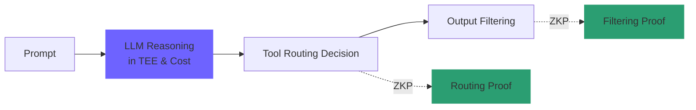
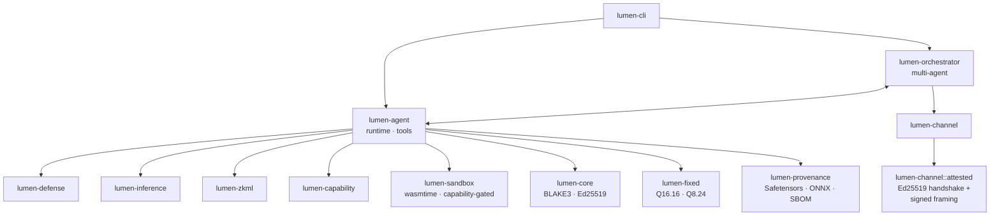

```mermaid
flowchart LR
    subgraph Host["Host (TEE)"]
        direction LR
        L[LLM Reasoning<br/>GPU Acceleration]
        W[Model Weight Protection]
        PE[Policy Engine]
        CI[Capability Vali/Verif]
    end
    subgraph Sandbox["WASM Sandbox"]
        direction LR
        AL[Agent Logic]
        TR[Tool Calling Routing]
        OF[Output Filtering]
    end
    Host <-->|Attested Channel| Sandbox
    style Host fill:#31455e,stroke:#31455e
    style Sandbox fill:#756b44,stroke:#756b44
```

# Lumen

Lumen은 제로 트러스트 환경을 위한 검증 가능한 AI 에이전트 프레임워크 오픈 소스 프로젝트입니다.

## 왜 Lumen인가

LLM 에이전트가 의료, 금융, 국방, 정부와 같은 고규제 영역으로 진입하면서 두 가지 근본 문제가 동시에 발생합니다. 

1. *'에이전트의 행동을 어떻게 신뢰할 수 있는가?'*
   - 모델 가중치가 변조되지 않았는지, 정책이 우회되지 않았는지, 도구 호출 결정이 외부에서 검증 가능한지 
2. *'에이전트의 권한을 어떻게 통제할 수 있는가?'*
   - 파일, 네트워크, 시스템 호출이 명시적으로 승인된 범위 안에서만 일어나는지, 권한 토큰을 위조하거나 재사용할 수 없는지

기존 *LangChain*, *AutoGPT*, *CrewAI* 등의 LLM 에이전트 프레임워크는 개발 편의성을 우선하지만, 이 두 가지를 *런타임에서 강제하는* 인프라가 없습니다. Lumen은 정확히 그 빈자리를 채우기 위해 설계된 **고보안 Rust 프레임워크** 입니다.

## 철학

### 제로 트러스트 (Zero-Trust)

Lumen의 모든 설계 결정을 관통하는 원칙은 다음과 같습니다.

> 디스크에 있는 어떤 바이트도, 메모리에 있는 어떤 객체도, 네트워크에서 온 어떤 메시지도, **증거 없이는 신뢰하지 않는다.**

이 원칙이 코드베이스 전체를 관통합니다. 정책 파일은 BLAKE3 해시로 핀(pin) 되며, `lumen run --policy-hash <HEX>`의 핀이 실제 파일 해시와 일치하지 않으면 즉시 거부됩니다. 모델 파일은 BLAKE3와 (선택적) Ed25519 서명으로 검증된 후에만 inference 엔진에 도달할 수 있습니다. **WASM 샌드박스 안의 에이전트는 명시적 Capability 토큰 없이는 어떤 도구도 호출할 수 없으며**, TEE 채널은 pre-pinned 상호 키 핸드셰이크를 사용하여 *Trust on First Use* (TOFU) 자체를 허용하지 않습니다.

### 폐쇄 (Air-Gapped) 친화

설계 목표는 **인터넷 연결이 없는 폐쇄망에서 동작**하는 것입니다. 따라서 빌드는 외부 호출이 없는 self-contained 형태이며, Cargo workspace와 검증된 의존성 핀으로 구성됩니다. 해시, 서명, ZKP 생성과 같은 모든 검증은 로컬에서 수행됩니다. 그리고 결정성이 보장되어, 같은 입력은 같은 비트로 재생산 가능한데 이는 ZKP 재현성의 전제 조건입니다.

### AI 및 보안 오픈소스 기여

Lumen은 학술 발표나 폐쇄 솔루션이 아닌 **오픈소스 라이브러리**로 공개되어, 같은 문제를 마주한 사람들이 동일한 보안 기반을 공유할 수 있도록 합니다. [Apache-2.0](LICENSE-APACHE) 또는 [MIT](LICENSE-MIT) 듀얼 라이선스로 상업, 연구, 정부 사용 모두 가능합니다.

오픈소스인 이유는 단순합니다. 보안 인프라는 *감사 가능*해야 하고, 감사 가능하려면 코드가 공개되어 있어야 합니다. 폐쇄형 보안 솔루션의 신뢰성은 그것을 만든 회사에 대한 신뢰로 환원되며, 이는 제로 트러스트 철학과 정면 충돌합니다. 제로 트러스트으ㅢ 핵심 원칙은 "Never Trust, Always Verify"이며, 이는 내부 직원 뿐만 아니라 사용하는 도구와 공급망도 포함되기 때문입니다.

**Team Quant는 막강한 보안을 이상으로 생각하며, 언제든 오픈소스 생태계의 큰 발전을 위해 기여할겁니다.**

## 4개의 핵심 축

부가 설명에 대해 각 단에 배치된 TIP 또는 NOTE Alert를 통해 확인하실 수 있습니다.

### 하이브리드 zkML 파이프라인

전체 LLM 추론을 ZKP로 감싸는 것은 *(현재로서는)* 비현실적으로 비쌉니다. 70억 파라미터 모델 한 토큰의 추론을 *halo2* 회로화하려면 **개별 작업에 대해 분 단위 시간이 필요**합니다. Lumen은 대신 **선택적 ZK 증명** 전략을 취하여, **비용이 큰 LLM 추론은 TEE 안에** 두고 *도구 라우팅 결정*과 *출력 필터링*에만 ZKP를 생성합니다.



> [!TIP]
> TEE는 하드웨어적으로 보호받는 절대 뚫리지 않는 금고라고 할 수 있습니다. ZKP만큼 완벽하진 않지만, 속도가 빠르고 밖에서 조작할 수 없어 무거운 AI 연산을 돌리기에 최적화되어 있습니다.

도구 선택과 출력 필터링은 *argmax*, *lookup table*, *regex match*와 같은 작은 회로로 표현 가능하므로 ezkl 또는 halo2 클래스 시스템으로 증명 가능합니다. 이렇게 하면 LLM 자체는 비밀로 유지되면서도 $`(\text{prompt}, \text{policy}) \mapsto \text{tool\_id}`$ 매핑은 외부에서 검증 가능해지고, 정책 우회 시도가 ZKP 차원에서 들통나게 됩니다.

**현재 구현**은 `ProvingSystem` trait 위에 `MockCommitmentProver`(BLAKE3 commitment)와 ezkl/halo2 feature 스텁이 올라가 있으며 실제 회로화는 [v0.3](#로드맵)에서 진행됐습니다. 증명과 commitment의 구분이 핵심입니다. `Verification::ZkVerified`와 `Verification::CommitmentOnly`는 명시적으로 별개 variant로 분리되어 mock 백엔드가 *절대* "ZK 증명됨"을 주장할 수 없도록 타입 시스템 차원에서 강제됩니다. Mock의 `verify` 함수는 witnessless 호출을 명시적으로 거부하고, 별도의 `verify_with_witness` API만 `CommitmentOnly`를 반환할 수 있습니다.

### 권한 분리형 Host-WASM 샌드박스

호스트와 샌드박스(snadbox)는 명확히 분리된 책임을 가집니다. 호스트(TEE) 측은 LLM 추론(GPU 가속)과 모델 가중치 보호, 정책 엔진, Capability 발급과 검증을 담당합니다. WASM 샌드박스 측은 에이전트 로직, 도구 호출 라우팅, 출력 필터링을 담당합니다. 양측은 *Attested* 보안 채널로만 통신합니다.



**WASM 격리**(wasmtime)는 다음 결정론 옵션으로 구성됩니다.

`wasm_simd(false)`와 `wasm_relaxed_simd(false)`로 SIMD를 비활성화합니다. **이는 NaN 비결정성의 주요 원인**이기 때문입니다. `cranelift_nan_canonicalization(true)`로 남은 부동소수점 NaN도 표준 표현으로 정규화하며, `consume_fuel(true)`로 CPU 사용량을 fuel 단위로 hard cap합니다. `epoch_interruption(true)`가 wall-clock 기반 추가 차단점을 제공하고, `max_wasm_stack(...)`으로 스택 폭주를 방지합니다. WASM threads는 feature 차원에서 비활성화되어 공유 linear memory를 차단합니다.

> [!NOTE]
> 소수점 계산을 할 때 환경마다 미세하게 결과가 달라질 수 있기 때문에 ZKP는 결과가 정확히 일치해야 수학적으로 증명이 가능합니다. 이에 오차가 발생할 수 있는 SIMD 등의 기능을 모두 비활성화하여 계산 방식을 하나로 통일하는 겁니다.

모든 호스트 임포트는 `lumen.` 네임스페이스 + Capability 검증을 거칩니다. `lumen_log(level, ptr, len)`는 Capability가 불필요하고 audit 로그만 남기지만, `lumen_call_tool(tool_ptr, tool_len, args_ptr, args_len) -> i32` 는 Capability 검증을 통과해야 호스트 측에서 도구가 실행되며 실패 시 $-1$(권한 거부) 또는 $-2$(메모리 오류)를 반환합니다. WASM 메모리에서 호스트로 들어오는 모든 바이트는 *즉시* 호스트 측 `Vec` 으로 복사되어, 정책 검사와 사용 사이에 게스트가 버퍼를 변경할 수 없도록(TOCTOU 방지) 보장합니다.

> [!NOTE]
> 쉽게 말해 **감사 로그는 허용**되지만 **시스템 도구를 호출하려 할 때 엄격한 Capability 검증을 통과해야 함**을 의미합니다. 실패 시 권한 오류를 반환합니다. 또한, WASM Sandbox에서 호스트에게 바이트(일종의 서류)를 확인하고 **승인하는 찰나에 바이트가 "악성"(예를 들어, 시스템 내용 전체 삭제 등)으로 변경되는 문제를 해결**하기 위해 `Vec`으로 바이트에 대한 복사본을 생성하고 해당 복사본을 검사 및 실행합니다.

**Capability 모델**은 Ed25519로 서명된 토큰입니다.

```rust
struct Capability {
    body: CapabilityBody {
        id: CapabilityId,
        audience: AgentId,     // 누가 사용할 수 있는가
        resource: Resource,    // 무엇에 대한 권한인가
        nonce: [u8; 16],       // 리플레이 방지
        expires_at: Timestamp, // 만료
        issuer: AgentId,
    },
    signature: Signature,      // Ed25519 서명
}

enum Resource {
    FsRead(PathPattern),
    FsWrite(PathPattern),
    Net(HostPattern),
    Tool(ToolId),
    InferenceTokens { max: u32 },
    ZkProofRequest,
}
```

`PolicyEngine::check`는 4단 검증을 수행합니다. *서명* 은 신뢰된 issuer의 공개키 중 하나로 검증되고, *audience*는 요청한 agent와 일치해야 하며, *만료*는 현재 시각보다 미래여야 하고, *리소스*는 요청한 action과 일치해야 합니다. 네 검증을 모두 통과한 후에야 nonce가 LRU 테이블(capacity $65{,}536$)에 기록되어 재사용 시 리플레이로 거부됩니다. 실패한 cap은 nonce테이블을 소진하지 않도록 설계되었습니다.

**Attested Secure Channel**은 *호스트 <-> WASM* 또는 *호스트 <-> TEE* 통신을 Ed25519 상호 핸드셰이크로 보호합니다. 핸드셰이크 시 양측 모두 *pre-pinned* peer 공개키를 가지고 있어야 하며 (TOFU 없음), 자기 ID와 peer ID와 nonce를 서명한 SignedHello를 교환하고, peer의 hello에서 `marker`, `peer_id`, `my_id`, `signature`를 모두 검증합니다. 이후 모든 데이터 프레임은 $(\text{epoch}, \text{seq})$ 쌍을 포함하여 서명되며, 수신 측은 서명 검증과 함께 epoch가 핸드셰이크 시 합의된 값과 일치하는지, seq가 정확히 다음 기대값과 일치하는지를 확인합니다. skip 거부가 곧 reorder/replay 거부입니다.

```text
HelloFrame  := { marker: "lumen.attested.v1",
                 my_id: VerifyingKey, peer_id: VerifyingKey, nonce: [u8;16] }
SignedHello := { hello: HelloFrame, signature: Signature }
DataFrame   := { epoch: u64, seq: u64, payload: Vec<u8> }
SignedFrame := { frame: DataFrame, signature: Signature }
```

TEE attestation은 동일한 프레임 형식에 `marker = "lumen.attested-tee.v1"`와 `attestation_doc: Vec<u8>` 필드를 추가하는 방식으로 v0.3에서 확장되었습니다. 검증자는 software marker 를 명시적으로 거부할 수 있어 *"attestation이 필요한데 software fallback으로 silent downgrade"* 같은 사고가 원천 차단됩니다.

> [!NOTE]
> WASM은 외부에 접근하기 위해 Capability를 제춣해야 합니다. 이는 Ed25519로 서명되어 위조 불가능합니다. 이를 출입증으로 예를 들어, 제출 시 호스트가 **(1) 위조되지 않았는지(서명 확인)**, **(2) 본인이 맞는지**, **(3) 유효기간이 남았는지**, **(4) 허락된 문이 맞는지**를 확인합니다. 이러한 검문을 통과하면 nonce에 '사용 완료'를 표시하고 접근을 허용합니다.
> 
> Attested Secure Channel는 **WASM은 호스트에 대화를 나눌 때 사용하는 통신 규격**입니다. 위 문단에서 **TOFU는 처음 만난 사람을 일단 믿고 보는 느슨한 방식을 의미**합니다. Lumen은 이 방식을 거부하고 처음부터 '사전에 등록된 인증키(pre-pinned)'를 가진 상대와만 대화를 시작합니다. 이 규격은 **SignedHello**, **메시지 일련번호(seq) 할당**, **동일한 보안 등급 요구(silent downgrade 방지)** 보안 체계를 형성합니다.

### 결정론적 제어 모듈

ZKP의 재현성을 보장하려면 같은 입력이 같은 비트를 산출해야 합니다. 부동소수점은 하드웨어와 컴파일러 의존성으로 비트 차이를 만들기 때문에 **proof-binding 경로에서 사용 금지**입니다.

`lumen-fixed` 크레이트는 두 가지 Q 형식을 제공합니다. **Q16.16**은 `i32` 위에 구축되어 $\pm 32{,}768$ 범위와 $\approx 1.5 \times 10^{-5}$ 정밀도를 가지며 activation 스코어와 라우팅 가중치에 사용됩니다. **Q8.24**도 `i32` 위에 있지만 $\pm 128$ 범위와 $\approx 6 \times 10^{-8}$ 정밀도로 정규화된 weights와 softmax출력에 사용됩니다. 모든 연산은 saturating arithmetic 이 기본입니다.

```rust
let two = Q16_16::from_i32(2);
let half = Q16_16(1 << (Q16_16::FRAC_BITS - 1));
assert_eq!(two * half, Q16_16::ONE); // 2 * 0.5 = 1.0, exact
```

`f32` <-> `Q*` 변환은 `calibration` feature 뒤로만 허용 (offline weight 준비용) 되며, 런타임 빌드에서 이 feature가 활성화되면 *컴파일러가 경고* 하도록 설계되어 있습니다.

다른 결정성 메커니즘으로는, 순회 결정성이 필요한 모든 자료구조에 `BTreeMap`과 `BTreeSet`을 사용하여 `HashMap`의 random seed를 회피하고, 병렬화에도 비트-동일한 BLAKE3 해시, 호스트 endianness와 무관한 canonical 직렬화인 postcard, 그리고 wasmtime의 SIMD off와 NaN canonicalization on을 통해 WASM 안의 부동소수점도 안전하게 다룹니다.

검증은 `crates/lumen-agent/tests/determinism_stress.rs`가 보장합니다. 같은 입력으로 100회 직렬 실행 시 byte-identical proof가 나오는지, 같은 입력으로 32회 병렬 실행 (다른 tokio 태스크) 시에도 byte-identical proof가 나오는지, 그리고 다른 prompt가 다른 proof를 생성하는지(positive control)를 확인합니다.

> [!NOTE]
> 앞서 설명했듯 ZKP는 결과가 정확히 일치해야 합니다. 이를 위해 **(1) 부동소수점 퇴출**, **(2) 고정소수점 도입**, **(3) B-Tree 자료구조 사용**, **(4) 가혹한 stress 테스트**를 적용하여 AI가 계산을 할 때 **하드웨어나 환경의 영향을 받아 제멋대로 굴지 못하도록** 모든 수학적 계산과 데이터 정렬 방식을 100% 예측 가능하게 통제합니다.

### 고속 보안 방어 및 Provenance

**프롬프트 인젝션 방어**(`lumen-defense`)는 사전 컴파일된 automaton으로 sub-100µs/kB 목표를 추구하는 **3단 파이프라인**입니다. 첫 번째 단계인 *Lexicon*은 Aho-Corasick 자료구조로 30개 이상의 알려진 *"ignore previous instructions"*, *"DAN mode"*, role-override 시퀀스, prompt leak 등의 jailbreak(탈옥) 패턴을 매칭하며 `OnceCell`로 정적 컴파일됩니다. 두 번째 단계인 *Regex*는 `eval(...)`, `os.system(...)`, base64 decode + exec, curl/wget URL, sudo rm 같은 고차원 패턴을 하나의 RegexSet으로 단일 pass 평가합니다. 세 번째 단계인 *Heuristic*은 non-printable byte 비율, base64-likeness, 길이 임계를 가중 평균하여 **점수가 임계를 넘으면** `Verdict::Suspect{score}`를 반환하며 **차단 결정은 호출자에게 위임**합니다. 다소 핵심적인 로직이라고 할 수 있겠네요.

```rust
pub enum Verdict {
    Allow,
    Suspect { score: u8 }, // 0..=100
    Block(BlockReason),
}

pub enum BlockReason {
    Lexicon(String), // 어떤 패턴이 매치했는지 audit 가능
    Regex(usize),    // 어떤 regex 가 매치했는지 (안정적 인덱스)
}
```

`corpus_version` 핀(`"lumen-defense/lexicon/0001"`)이 audit log와 ZK witness에 포함되어 검증자가 동일한 corpus로 재현 가능합니다. corpus가 바뀌면 fingerprint가 바뀌고, witness에 박힌 fingerprint와 검증 시 fingerprint가 다르면 verification이 실패하여 silent corpus drift가 차단됩니다.

**모델 Provenance**(`lumen-provenance`)는 BLAKE3 전체 파일 해시와 선택적 Ed25519 서명 검증을 수행합니다. Safetensors 헤더는 구조 검증만 거치고 텐서를 인스턴스화하지는 않습니다. ONNX 헤더 검증은 직접 작성한 100여 라인 protobuf 디코더로 수행되며, CycloneDX 1.5 SBOM이 BLAKE3 algorithm과 license 메타데이터를 포함하여 자동 생성됩니다.

ONNX 디코더가 `prost-build`가 아닌 직접 작성인 데에는 세 가지 이유가 있습니다. 

1. 적대적 입력에 대한 공격 면적을 최소화(100 라인은 audit 가능한 분량).
2. `protoc` binary 의존성을 제거하여 빌드 환경을 단순화하고 에어갭 친화성을 확보.
3. 모든 varint 경계 검사, deprecated group wire-type 즉시 거부, 미지정 필드의 안전한 skip을 확보하면서 $`\text{MAX\_HEADER\_SCAN\_BYTES} = 16\,\text{MiB}`$ 하드 캡까지 적용.

```rust
pub struct OnnxHeader {
    pub ir_version: i64,               // 1..=12 만 허용
    pub producer_name: String,
    pub producer_version: String,
    pub domain: String,
    pub model_version: i64,
    pub opset_imports: Vec<OnnxOpset>, // version > 0 검증
}
```

검증을 통과한 헤더만 SBOM에 포함되며, SBOM은 검증한 모델 파일의 BLAKE3 해시와 매니페스트의 라이선스를 CycloneDX 1.5호환 JSON으로 출력합니다.

> [!NOTE]
> 프로프트를 통한 jailbreak를 방지하기 위해 sub-100µs/kB 속도로 작동하는 **(1-Lexicon) 금지어 검사**, **(2-Regex) 고차원 악성 패턴 검사**, **(3-Heuristic) 이해할 수 없거나 의심스러운 값에 대한 점수 부여** 3단계의 파이프라인을 구축했습니다. 1단계의 금지어 명단(corpus)은 계속 업데이트되기 때문에 ZKP는 '정확히 그때 그 corpus'로 검사했다는 걸 증명해야 합니다. corpus의 버전 번호(fingerprint)를 증서(witness)에 박아넣고 나중에 누군가 몰래 규칙책을 바꾸는 걸 차단합니다.
> 
> `lumen-provenance`의 동작은 흥미롭습니다. 이는 ONNX, Safetensors 등의 모델 파일이 해커에 의해 조작되지 않았는지를 검사하는 과정입니다. `prost-build`를 사용하지 않고 100여 라인 검사기를 채택한  세 가지 이유로는 **(1) 공격 표면 최소화**, **(2) 폐쇄 환경 친화성**, **(3) 철저한 용량 제한 및 안전성**을 챙기기 위함입니다.

## 아키텍처 개요

전체 시스템은 다음과 같이 구성됩니다.



`AgentRuntime::step(prompt) -> StepResult`의 한 스텝은 정해진 순서로 진행됩니다. 

- **Defense** 단계: `DefenseEngine::analyze(prompt)`가 호출되고 `Verdict::Block`이면 즉시 단축되어 `StepResult`에 `defense_verdict`가 기록됩니다.
- **Inference** 단계: `InferenceEngine::complete(prompt, params)`가 `Completion { text, tool_call }`을 반환합니다.
- **Policy** 단계: `tool_call.is_some()`인 경우 해당 tool의 Capability를 lookup하고 `PolicyEngine::check`로 4단 검증을 수행합니다. 검증을 통과하면 **Tool 실행** 단계에서 호스트 측 `ToolHandler::call(args_json)`이 호출되고 JSON 출력이 캡처됩니다.
- **Routing decision 구축** 단계: 다음과 같은 public 입력과 witness가 결정됩니다.

```rust
public  = { prompt_hash, policy_hash, tool: chosen_tool_id }
witness = { args_hash, defense_corpus: corpus_version }
```

마지막으로 **Prove + Verify** 단계에서 `ProvingSystem::prove(vk, &public, &witness) -> Proof`가 호출되어 즉시 self-verify가 수행됩니다. mock 백엔드는 `Verification::CommitmentOnly` 또는 `Invalid`만 반환할 수 있으며 `ZkVerified`는 절대 반환할 수 없습니다. `StepResult`에는 `completion`, `tool_output`, `routing`, `proof`, `verification`, `defense_verdict`이 모두 포함되어 호출자가 audit 또는 serialize할 수 있습니다.

## 위협 모델

Lumen이 방어하는 공격은 카테고리별로 다음과 같습니다.

- **파일 시스템 무결성**: 측면에서 디스크의 모델 파일 변조는 BLAKE3 해시와 Ed25519 서명 검증으로, 디스크의 정책 파일 변조는 `--policy-hash` 핀 강제로 차단됩니다.
- **프롬프트 측면 공격**: jailbreak 삽입이 lexicon, regex, heuristic으로 구성된 defense engine으로 차단되며, defense corpus가 변경된 줄 모르고 실행되는 *silent corpus drift*는 `corpus_version`이 ZK witness에 박혀 있어 검증 시 발견됩니다.
- **런타임 권한 통제**: 이 측면에서 도구 호출로 권한 외 동작을 시도하면 Capability 토큰 검증(서명·만료·audience·nonce)이 거부하며, 리플레이된 capability 재사용은 정책 엔진 내부의 nonce LRU 테이블이 차단합니다.
- **채널 보안**: 이 측면에서 호스트와 샌드박스 사이 메시지 가로채기는 attested channel의 Ed25519 mutual auth와 signed frames가 방어하고, 메시지 리플레이는 $(\text{epoch}, \text{seq})$ 시퀀스 번호로 거부됩니다.
- **WASM 자원 제어**: 이 측면에서 무한 루프나 메모리 폭주는 wasmtime의 fuel + epoch interruption + memory_pages cap으로 hard limit 됩니다.
- **멀티 에이전트 격리**: 이 측면에서 에이전트 간 정보 누출은 tokio 격리 태스크 + 채널-only 통신으로 방어되며 공유 메모리 자체가 없습니다.
- **ZK 증명 위조**: 이 경우 mock 백엔드에서는 BLAKE3 binding 으로 witness 없이는 재계산이 불가능하고, v0.3 이후 실제 백엔드에서는 ezkl/halo2의 soundness가 보장합니다.
- **ZK 재현성 공격**: 비결정성을 이용해 증명 차이를 만드는 시도는 정수 fixed-point + BLAKE3 + BTreeMap + wasmtime SIMD off 조합으로 차단됩니다.
- **적대적 ONNX 헤더**: varint overflow, group wire-type 등은 직접 작성한 strict 디코더의 모든 경계 검사로 거부됩니다.

명시적으로 *방어하지 않는* 것들도 분명히 해두어야 합니다. 신뢰된 issuer의 private key 누출은 PKI 책임 영역으로 Lumen은 issuer 키가 **안전하게 관리된다고 가정**합니다. 이건 확실히 중요합니다. 호스트 OS가 손상된 경우는 TEE의 책임이며 v0.3 attestation으로 **부분적으로만 완화**됩니다. LLM 자체의 환각은 fine-tuning 또는 RLHF 영역으로 Lumen은 *결정과 도구 호출*만 검증합니다. 마지막으로 cold boot 또는 side-channel같은 물리적 접근 공격은 **전용 하드웨어 영역**입니다.

> [!IMPORTANT]
> HSM의 연결성을 고려하여 암호학적 기능을 몇 가지 수정해야 할 수 있습니다.

## 사용 시나리오

- **정부 폐쇄망 안의 문서 분석 에이전트** 시나리오에서는 LLM 추론이 SGX 또는 TDX 안에서 실행되고, 에이전트 로직은 WASM 샌드박스에서 격리된 채 `read_classified_doc`, `summarize`, `cross_reference`같은 도구만 호출합니다. 모든 도구 호출이 ZKP되어 후속 감사에 활용 가능하며 모델 가중치는 정부 인증 BLAKE3 해시로 핀(pin) 됩니다.
- **의료 진단 보조 LLM** 시나리오에서는 환자 데이터 접근 capability가 환자 ID별로 발급되어, 에이전트가 다른 환자의 데이터를 시도하면 정책 엔진이 거부하고 감사 로그에 기록합니다. 모델 가중치는 FDA 인증 hash로 핀 되며 SBOM 자동 생성으로 **규제 보고가 처리**됩니다.
- **금융 거래 자동화 에이전트** 시나리오에서는 **각 주문 결정에 ZKP가 첨부되어 규제 기관이 결정 과정을 재현하고 검증**할 수 있습니다. 모델은 변경 시 Ed25519 서명과 SBOM 갱신 후에만 배포되며, 거래 도구 - `place_order`, `cancel_order` - 에 capability 발급 시 **가격과 수량 한도까지 명시**할 수 있습니다.
- **다중 에이전트 협업 시스템** 예를 들어 *법률 검토 + 회계 검토* 시나리오에서는 Orchestrator가 법률 에이전트와 회계 에이전트를 별도 tokio 태스크로 spawn합니다. 두 에이전트는 인터-에이전트(내부 에이전트) 채널로만 통신하므로 메모리 공유가 없습니다. capability-gated messaging를 통해 각 에이전트가 어떤 다른 에이전트와 통신할 수 있는지도 정책으로 제어할 수 있습니다.

## 로드맵

**v0.1**(완료) 마일스톤은 4개 축 모두에 동작하는 minimal 구현, mock zkML, dummy inference, WAT fixture 샌드박스, Capability + Policy + Audit, BLAKE3 / Ed25519 provenance + CycloneDX SBOM, 단일 에이전트 orchestrator, 그리고 데모 CLI 와 hello_agent 예제를 포함합니다.

**v0.2**(완료) 마일스톤은 다중 에이전트와 인터-에이전트 메시징 (스타-라우팅), ONNX 헤더 검증 (직접 작성 protobuf 파서), 결정성 100회 + 32-병렬 byte-equal 스트레스 테스트, software-attested SecureChannel(Ed25519 handshake + signed frames)을 추가했습니다. 89개 테스트가 통과하며 `clippy -D warnings` 가 clean 합니다.

**v0.3**(완료, 공개 지점) 마일스톤은 실제 Rust -> wasm32 에이전트 빌드 파이프라인과 SDK, ezkl 또는 halo2 실제 회로 (argmax 와 softmax routing 부터), TEE attestation 문서 파싱 (Intel TDX quote, AMD SEV-SNP 보고서), candle 통합 (소형 ONNX 모델 추론), GitHub Actions CI(build + test + clippy + cargo-deny + cargo-audit)를 포함합니다.

**v0.4**(완료) 마일스톤은 온체인(Mina 또는 EVM) 검증기 emit + 배포 자동화 (`lumen-onchain` 크레이트와 `lumen verifier emit/deploy` 서브커맨드), capability-gated 인터-에이전트 메시징 (`Resource::AgentMessage(AgentId)` + `Orchestrator::with_policy`), AES-GCM-256 + x25519 채널 암호화 (mutual-authenticated ephemeral KEX, blake3 KDF, direction-별 키, deterministic nonce), Rust -> WASM 에이전트 SDK (`#[lumen_agent]` proc macro - `lumen-sdk-macros` 크레이트), 그리고 모델 핀 자동 회전(`PinSet` + grace period로 무중단 배포)을 추가합니다.

**v1.0**(목표)는 정부 또는 규제 환경에서 production 배포, [FIPS 140-3 compliance audit](https://csrc.nist.gov/pubs/fips/140-3/final), [Kani](https://www.in-com.com/ko/blog/the-rust-developers-toolbox-best-static-code-analysis-tools/#Kani) 또는 [Prusti](https://github.com/viperproject/prusti-dev) 등을 활용한 일부 모듈의 형식 검증, 외부 보안 audit 1회 통과를 목표로 합니다. 정식 통과되지 않아도 여전히 공개하겠습니다. 물론 검증되지 않았다는 표시를 명확히 하겠습니다.

## 참고 문헌과 관련 프로젝트

Lumen은 여러 검증된 오픈소스 프로젝트 위에 *조립*되었습니다. [ezkl](https://github.com/zkonduit/ezkl)은 ONNX 모델의 ZKP 생성 도구이고, [halo2](https://github.com/zcash/halo2)는 Zcash의 PLONKish 증명 시스템입니다. [wasmtime](https://wasmtime.dev/)은 Bytecode Alliance의 WASM 런타임이며, [CycloneDX](https://cyclonedx.org/)는 OWASP 의 SBOM 표준입니다. [ONNX](https://onnx.ai/)는 모델 교환 포맷이고, [Safetensors](https://github.com/huggingface/safetensors)는 Hugging Face의 안전한 텐서 직렬화 형식입니다. [BLAKE3](https://github.com/BLAKE3-team/BLAKE3)는 빠른 가지치기 가능한 해시이고, [Ed25519](https://ed25519.cr.yp.to/)는 DJB의 결정론적 서명입니다. *Aho-Corasick*은 다중 패턴 문자열 매칭 자료구조이고, [postcard](https://github.com/jamesmunns/postcard)는 `no_std` 친화 직렬화입니다.

다시 한 번, Lumen은 이들 프로젝트 위에 *조립*되었으며, 통합되지 않은 보안 속성들을 *런타임에서 강제*하는 글루 코드입니다.

## 그 외

이 문서의 내용이 어떻게 느껴지시나요? 문제가 있다고 생각하시거나, 저희가 생각한 방향에 의문점이 있다면 여러분의 주장을 적극적으로 표현해주셔도 됩니다. 초보자 친화적으로 문서를 추가 또는 수정하는 것을 고려하겠습니다.

의견은 [이슈](https://github.com/Quant-Off/lumen/issues) 또는 이메일 다이렉트 <qtfelix@qu4nt.space>로 알려주시면 감사하겠습니다. 기여에 대해선 [CONTRIBUTING.md](CONTRIBUTING.md) 문서를 참고하세요.